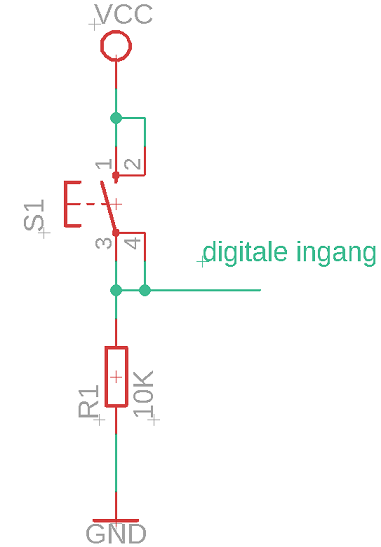

# Drukknop
## Algemene uitleg

Met een drukknop is het mogelijk een logische "1" en "0" te creëren aan de ingang van de arduino.

## Schema

Wanneer de drukknop ingedrukt is ontstaat er een gesloten stroomkring en komt de voedingsspanning volledig over de weerstand R1 te staan. Hierdoor onstaat een logische "1" aan de ingang van de arduino.
Wanneer de drukknop niet ingedrukt is staat alle spanning over het open contact van de drukknop en staat er een logische "0" aan de ingang van de arduino.



### Opdrachten
 * Bereken de stroom door de weerstand en de drukknop wanneer de drukknop ingedrukt is.
 * Bereken de stroom door de weerstand en de drukknop wanneer de drukknop niet ingedrukt is.
 * Bouw de schakeling op een breadboard en meet de spanning over R1 na wanneer de drukknop ingedrukt is en wanneer de drukknop niet ingedrukt is. Vergelijk deze waardes met de berekende waardes.

 ## Aangepast schema

 Veronerstel dat je per ongeluk de pin waarop de schakeling aangesloten is programmeert als uitgang in plaats van als ingang. Wat zou er gebeuren wanneer je de een logische "0" plaatst op de pin en de drukknop indrukt?

 Een oplossing hiervoor is deze stroom te beperken door weerstand R2 te plaatsen zoals in onderstaande schema.


### Opdrachten
 * Bereken de spanning tussen de digitale ingang en de massa. (De spanning over weerstand R1). Valt deze nog binnen de waardes gezien in het deel "digitale ingang"
 * Bouw de schakeling op een breadboard en meet de spanning over R1 en R2 na wanneer de drukknop ingedrukt is en wanneer de drukknop niet ingedrukt is. Komen deze waardes overeen met de berekende waardes?

 ## Drukknop module
 
Wanneer je bij een project niet steeds wil gebruik maken van een drukknop en bijhorende weerstanden op een breadbord is volgende module een ideale oplossing.


Meer info over deze module kan je vinden op de site van een leverancier [TinyTronics.nl](https://www.tinytronics.nl/shop/nl/schakelaars/manuele-schakelaars/drukknoppen-en-schakelaars/robotdyn-drukknop-module-blauw)

## Arduino UNO

De pinnen 0 tot en met 13 zijn geschikt als digitale ingang.


## Aansluitschema Arduino UNO


 ## Voorbeeldcode arduino UNO

In onderstaande code licht de ingebouwde led op bij het indrukken van de drukknop via de if else structuur.

 ```cpp
#define drukknopPin 2

boolean drukknopStatus = false;

void setup() {
  pinMode(LED_BUILTIN, OUTPUT);  //ingebouwde led als uitgang plaatsen
  pinMode(drukknopPin, INPUT); // pin 2 als ingang plaatsen
}

void loop() {
  drukknopStatus = digitalRead(drukknopPin); //binnenlezen toestand ingang
  if (drukknopStatus == HIGH) { //indien toestand ingangspin "1" licht ingebouwde led op
    digitalWrite(LED_BUILTIN, HIGH);
  }
  else { //ander licht de ingebouwde led niet op
    digitalWrite(LED_BUILTIN, LOW);
  }
}
```

## Voorbeeldcode arduino UNO

In onderstaande code licht de ingebouwde led op bij het indrukken van 1 drukknop. Wanneer de andere drukknop ingedrukt wordt, licht de led niet meer op.

 ```cpp
#define buttonAan 2     // drukknop pin Aan
#define buttonUit 3     // drukknop pin Uit
#define ledPin 13      // LED pin

boolean buttonStateAan;     //variabele om de toestand van buttonStateAan te bewaren
boolean buttonStateUit;     //variabele om de toestand van buttonStateUit te bewaren

void setup() {
  pinMode(ledPin, OUTPUT); //pin 13 instellen als uitgang
  pinMode(buttonAan, INPUT); //pin 2 instellen als ingang
  pinMode(buttonUit, INPUT); //pin 3 instellen als ingang

  void loop() {
    buttonStateAan = digitalRead(buttonAan); //toestand inlezen
    buttonStateUit = digitalRead(buttonUit); //toestand inlezen
    if (buttonStateAan == HIGH) {
      digitalWrite(ledPin, HIGH);
    }
    if (buttonStateUit == HIGH) {
      digitalWrite(ledPin, LOW);
    }

  }
```

## ESP8266

De pinnen D0 tot en met D8 zijn geschikt als digitale ingang.


 ## Voorbeeldcode ESP8266

 ```cpp
# define drukknopPin D0
# define ingebouwdeLedPin D5

boolean drukknopStatus = false;

void setup() {
  pinMode(ingebouwdeLedPin, OUTPUT);  //ingebouwde led als uitgang plaatsen
  pinMode(drukknopPin, INPUT); // pin D1 als ingang plaatsen
}

void loop() {
  drukknopStatus = digitalRead(drukknopPin); //binnenlezen toestand ingang
  if (drukknopStatus == HIGH) { //indien toestand ingangspin "1" licht ingebouwde led op
    digitalWrite(ingebouwdeLedPin, HIGH);
  }
  else { //ander licht de ingebouwde led niet op
    digitalWrite(ingebouwdeLedPin, LOW);
  }
}
```